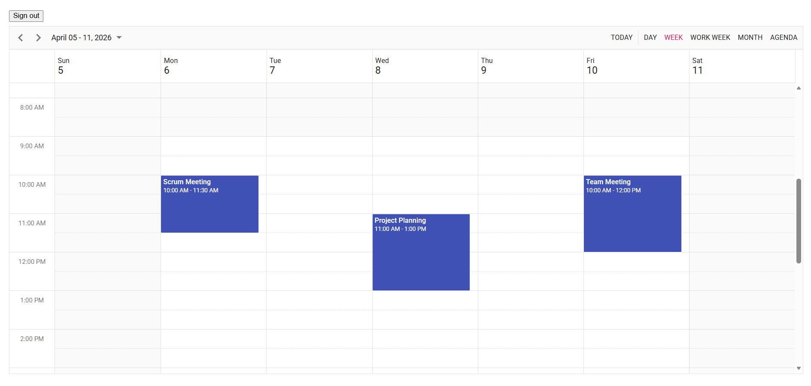

<!--
  howto.md
  A step-by-step guide to integrate Outlook Calender with Syncfusion React Scheduler
-->
# How to Integrate integrate Outlook Calender with Syncfusion React Scheduler

This repository contains a sample full-stack application demonstrating how to synchronize events between Outlook Calender and the Syncfusion React Scheduler component.The React frontend provides a responsive UI for viewing and managing calendar events.

## Prerequisites
- Node.js (>= 18.0)
- npm (>= 8.0)
- React (>= 18.3)
- Need to have a personal Microsoft account 

## Project Structure
```
├── README.md                           # This guide                   
├── public
│    ├── index.html                     # Root HTML file for React
├── src
│    ├── App.css                        # Styles for the App Component
│    ├── App.test.tsx
│    ├── App.tsx                        # Scheduler Integration
│    ├── AppContext.tsx
│    ├── Config.ts
│    ├── ErrorMessage.tsx               # Component for displaying error messages
│    ├── GraphService.ts
│    ├── index.css
│    ├── index.tsx
│    ├── logo.svg
│    ├── NavBar.tsx                     # Navigation bar component
│    ├── react-app-env.d.ts
│    ├── reportWebVitals
│    ├── Scheduler.css                  # Syncfusion Scheduler implementation
│    ├── Scheduler.tsx
│    ├── setupTests.ts
│    ├── Welcome.tsx
├── package.json                       
│── tsconfig.json

```
## Setup

### Cloning the repository
    
- Clone the repository to your local machine
### Set up application id

- Replace **YOUR_APP_ID** in the `config.ts` with your generated id to integrate your outlook calender events to the React scheduler.


## Running the Application
1. Install The Required Packages 
    ```bash
    npm install
    ```
2. Start the application:
    ```bash
    npm start
    ```
3. Navigate to [`http://localhost:3000`](http://localhost:3000) in your browser.

4. Click the Sign button with the Microsoft account to display outlook calender events on the scheduler.

5. You can perform CRUD operation on the scheduler that will be reflected in the Outlook Calender.

## Output Preview

*Image illustrating the Syncfusion React Scheduler*


## Troubleshooting
- **npm install stuck or fails**: Delete node_modules + package-lock.json, restart system, and reinstall using npm install.
- **401 Unauthorized**: Check App_ID in Config.ts


